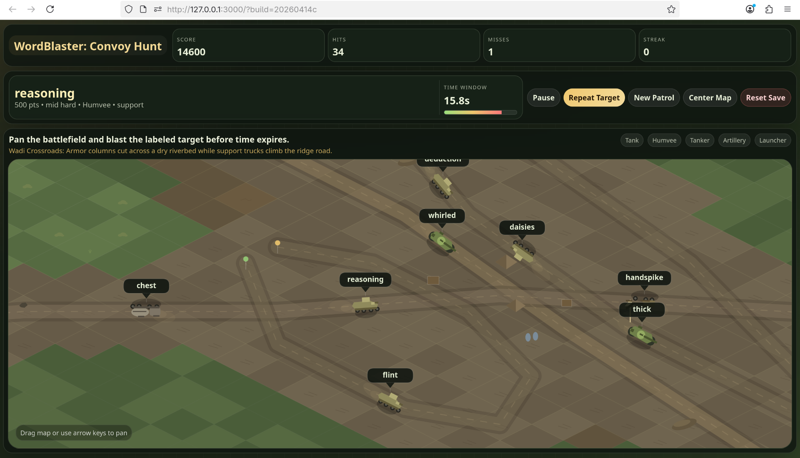

# WordBlaster

WordBlaster is a browser game designed to promote reading fluency for young kids. The player pans across an isometric battlefield, listens for a target word, finds the vehicle carrying that label, and blasts it before the timer expires.

The goal is not twitch shooting. The goal is visual word recognition under light pressure. The child hears a word, scans a dense field of similar-looking labels, decodes what they are seeing, and then confirms the match by clicking the correct target.



## What The Game Is Teaching

This build is aimed at early readers who benefit from repeated practice in:

- hearing a spoken word and matching it to printed text
- scanning left-to-right across cluttered visual fields
- distinguishing similar letter patterns quickly
- building confidence with a mix of easy, medium, and harder vocabulary
- learning from mistakes through immediate reveal-and-correct feedback

When the timer expires, the game moves the camera to the missed target and subtracts the points. That keeps the mechanic instructional instead of purely punitive.

## Screenshot Context

The current gameplay screenshot for this build shows the core loop clearly:

- a compact HUD across the top with `Score`, `Hits`, `Misses`, and `Streak`
- a current target card showing the word `reasoning`
- a visible countdown timer with about `15.8s` remaining
- the `Wadi Crossroads` patrol layout with intersecting roads and multiple moving vehicles
- a dense wall of labels such as `chest`, `reasoning`, `whirled`, `daisies`, `handspike`, `thick`, and `flint`
- no special highlight on the correct label, so the child must actually read and compare the words on screen

That screenshot captures the intended behavior well: the map is the focus, the HUD stays compact, and the child is pushed to read rather than rely on visual highlighting.

## Gameplay Loop

1. A patrol map is generated with moving convoys.
2. Each vehicle carries a visible label from the game dictionary.
3. The game speaks the target word using local text-to-speech.
4. The child pans across the isometric terrain and looks for the matching label.
5. A correct click triggers an explosion animation and awards points.
6. A miss or timeout subtracts points and reveals the correct target so the child can learn from the mistake.

The timer is currently set to `20` seconds, and totals can go negative.

## Reading-Focused Design Choices

- Labels stay visible at all times so the player is always reading the map.
- The correct target is not highlighted in advance.
- The dictionary is mixed across difficulty bands instead of progressing in strict easy-to-hard order.
- Repeats are suppressed so the child sees a broader range of vocabulary.
- Missed rounds temporarily bias the spatial challenge lower, but the vocabulary pool still stays mixed.

## Technical Overview

WordBlaster is intentionally simple to run locally:

- a static frontend in `public/`
- a small Node.js server in `server.js`
- a local save file in `data/`
- a local text-to-speech endpoint backed by Kokoro

There is no database and no external backend requirement for normal play.

## Frontend Implementation

The main game logic lives in `public/app.js`.

Key implementation details:

- The battlefield is rendered on a `<canvas>` using an isometric tile projection.
- Patrols are defined as named presets with terrain zones, props, lanes, and convoy compositions.
- Vehicles move along lane splines and reverse direction at path ends.
- Every vehicle always has a visible word label above it.
- The target selection system chooses both a vehicle and a word difficulty for the next round.
- The map supports drag-to-pan and keyboard panning.

Important frontend files:

- `public/index.html`: HUD and canvas shell
- `public/styles.css`: layout, color system, compact controls, and battlefield framing
- `public/app.js`: rendering, game loop, targeting, scoring, save calls, and prompt playback
- `public/word-bank.js`: the `500`-word dictionary used for target labels

## Word Selection And Difficulty Mixing

The dictionary is split into four scoring bands:

- `simple`: `100` points
- `medium`: `300` points
- `mid-hard`: `500` points
- `hard`: `1000` points

The current implementation does not force the child through easy words first. Instead:

- the game keeps a single `500`-word bank
- each new round chooses a difficulty tier with weighted randomness
- recent difficulty repeats are penalized
- recent exact word repeats are also suppressed

That gives a healthier mix of vocabulary while still keeping the session readable and fair.

## Map And Targeting Logic

Target selection combines two separate decisions:

1. Where the target should be on the battlefield.
2. What difficulty word should be assigned to that target.

Spatial challenge is adjusted with placement profiles:

- after misses, targets bias closer and more visible
- during stronger streaks, targets are allowed farther from center and across more map space

Vocabulary challenge is mixed independently from placement. That separation matters because it avoids the old pattern where easy words tended to appear first and harder words only arrived later.

## Text-To-Speech Implementation

Text-to-speech is handled locally in `server.js` through `kokoro-js`.

Current TTS pipeline:

- The server exposes `GET /api/tts`.
- The frontend builds prompt URLs with the text, selected voice, and speed.
- The server loads `onnx-community/Kokoro-82M-v1.0-ONNX`.
- Kokoro is initialized once with:
  - `dtype: "q8"`
  - `device: "cpu"`
- The generated waveform is returned as `audio/wav`.
- Audio is cached on disk in `data/tts-cache/` using a SHA-1 hash of:
  - prompt text
  - voice
  - speed

In the browser:

- the frontend creates an `Audio` object pointing at `/api/tts`
- the prompt starts playback before the target timer becomes active
- if local audio playback fails, the code falls back to browser `speechSynthesis`

That fallback exists for resilience, but the preferred path is the local Kokoro voice because it sounds much less robotic than stock browser speech.

Current prompt settings in the frontend:

- voice: `af_nicole`
- speed: `0.94`

## Save And Resume

Progress is persisted locally, not in browser-only storage.

The current save path is:

- `data/savegame.json`

The frontend talks to:

- `GET /api/save`
- `POST /api/save`
- `POST /api/save/reset`

Saved state includes:

- total score
- total hits
- total misses
- rounds cleared
- best streak
- current streak
- last update timestamp

This makes the game resumable across launches.

## Launcher And Local Desktop Use

The project includes a double-click launcher flow for Linux:

- `WordBlaster.desktop`
- `launch-wordblaster.sh`
- `StartWordBlaster`

The shell launcher:

- checks whether the local server is already responding
- starts `node server.js` if needed
- waits for the server to become ready
- opens the game in the default browser

The server also exposes `GET /health` for launcher readiness checks.

## Repo Structure

- `public/index.html`: main page shell
- `public/app.js`: gameplay, rendering, save integration, and TTS playback logic
- `public/styles.css`: UI and visual styling
- `public/word-bank.js`: 500-word label dictionary
- `server.js`: static file server, save API, health endpoint, and Kokoro TTS service
- `launch-wordblaster.sh`: local browser launcher
- `WordBlaster.desktop`: desktop entry for double-click startup
- `launcher/src/main.rs`: source for the native helper launcher

## Run Locally

```bash
npm install
npm start
```

Open:

```text
http://127.0.0.1:3000/
```

## Verification

Syntax checks:

```bash
npm run check
```

Current check script validates:

- `server.js`
- `public/app.js`
- `public/word-bank.js`

## Rebuilding The Native Launcher

If you want to rebuild the native `StartWordBlaster` helper from source:

```bash
cargo build --manifest-path launcher/Cargo.toml --release
```

This requires a system C linker such as `cc` or `gcc`.

## License

WordBlaster is licensed under the MIT License. See [LICENSE](LICENSE).

Third-party components used for local text-to-speech remain under their own
licenses. In particular:

- `kokoro-js` is Apache-2.0
- `onnx-community/Kokoro-82M-v1.0-ONNX` is Apache-2.0

See [THIRD_PARTY_NOTICES.md](THIRD_PARTY_NOTICES.md) for the current third-party licensing summary.
